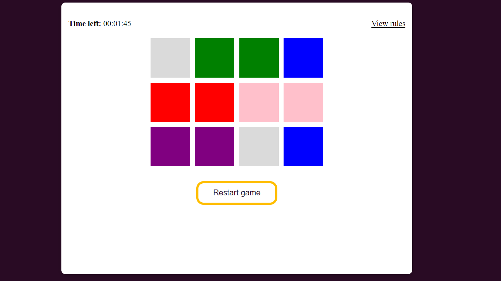

# Pick-A-Tile Game

## Screenshot

## Description

Pick-A-Tile is a memory game where you have to match pairs of tiles of the same color. The game starts with a countdown timer and if you correctly match all the pairs within the time limit, you win. If the timer runs out before you complete the game, you lose.

## Getting Started

1. Open the [game](https://jerryemet.github.io/pick-a-tile/) in your browser.
2. Click on any tile to reveal its color.
3. Try to find a matching tile of the same color.
4. If you find a match, both tiles will remain visible.
5. If you don't find a match, both tiles will flip back over.
6. Repeat steps 2-5 until you have matched all the pairs.
7. If you win, you will see a congratulatory message.
8. If you lose, you will see a message indicating that you ran out of time.

## Rules

1. Correctly match two tiles of the same color within one minute to win.
2. If the timer runs out before you complete the game, you lose.
3. The timer is stopped when you win.

## Planning Materials
[planning](https://docs.google.com/document/d/1DVz50hKpcoAyV6O8Y8UbmajSIwys5VFaWRmpEqc15_E/edit?usp=sharing)

## Technologies Used

- HTML
- CSS
- JavaScript

## Attributions

[Confetti library](https://www.npmjs.com/package/canvas-confetti)
[Fisher yates Algorithm](https://www.geeksforgeeks.org/shuffle-a-given-array-using-fisher-yates-shuffle-algorithm/)

## Next steps

- Add difficulty levels to the game
- Add Scores

## Contributing

If you would like to contribute to this project, please follow these steps:

1. Fork the repository.
2. Create a new branch.
3. Make your changes.
4. Submit a pull request.